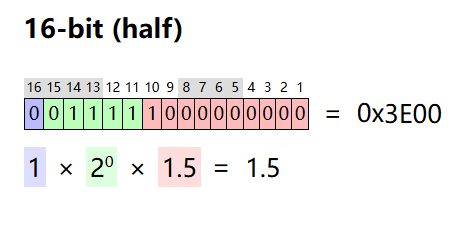

- [原码、反码、补码、移码](#原码反码补码移码)
  - [原码](#原码)
  - [反码](#反码)
  - [补码](#补码)
  - [移码](#移码)
  - [0的原码、反码、补码、移码](#0的原码反码补码移码)
- [浮点数的二进制表示](#浮点数的二进制表示)
- [浮点数加法运算](#浮点数加法运算)

### 原码、反码、补码、移码

原码、反码、补码和移码是计算机中表示和处理有符号数的几种方法。

#### 原码

原码是计算机中表示有符号数的一种最简单的方法。它使用最高位表示符号位，0表示正数，1表示负数，其余位表示数值的绝对值。例如，8位二进制数中，+5的原码表示为`00000101`，-5的原码表示为`10000101`。

#### 反码

反码是对原码的一种改进表示方法。正数的反码与原码相同，负数的反码是对原码逐位取反（符号位除外）。例如，8位二进制数中，+5的反码表示为`00000101`，-5的反码表示为`11111010`。

#### 补码

补码是计算机中最常用的表示有符号数的方法，**常用于进行数字加减法**。正数的补码与原码相同，负数的补码是其反码加1。例如，8位二进制数中，+5的补码表示为`00000101`，-5的补码表示为`11111011`。  

#### 移码

移码**通常用于表示浮点运算的阶码**。无论正数负数，都是将该原码的补码的首位(符号位) 取反得到移码。例如，假设使用8位移码，则+5的移码表示为`10000101`，-5的移码表示为`01111011`。  

#### 0的原码、反码、补码、移码

|     | 原码     | 反码     | 补码     | 移码     |
| --- | -------- | -------- | -------- | -------- |
| +0  | 00000000 | 00000000 | 00000000 | 10000000 |
| -0  | 10000000 | 11111111 | 00000000 | 10000000 |

### 浮点数的二进制表示

浮点数的二进制表示主要包含：符号位(16)、指数位(15-11)、尾数(10-1)

- 符号位：浮点数的正负
- 指数位：表示浮点数的指数部分（采用偏移法表示）
- 尾数：表示浮点数的精确值

[详细表示规则](https://zh.wikipedia.org/wiki/%E5%8D%8A%E7%B2%BE%E5%BA%A6%E6%B5%AE%E7%82%B9%E6%95%B0)

### 浮点数加法运算

1. 首先先进性对阶，阶码小的向阶码大的对齐，同时尾数进行右移（变小）。
2. 然后再对尾数进行加减法运算。
3. 然后进行规格化处理（IEEE754）。

